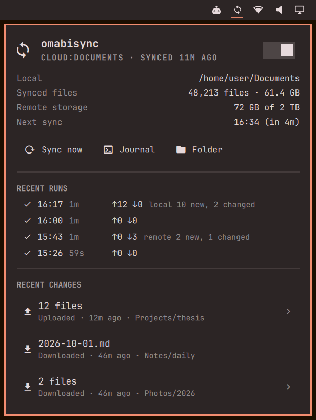

# omabisync

An Omarchy bar widget for two-way sync between a local folder and cloud storage with rclone bisync. It shows whether syncs worked, what changed, and when the next one runs.

This widget, along with rclone and systemd, replaces the typically bloated, unattractive apps of the cloud providers with a Linux-native solution matching Omarchy's aesthetic. The widget allows the rclone bisync process to be easily monitored from the desktop. On my machine, this replaces the pCloud desktop app, but it should work with any cloud storage that rclone bisync supports.

## What it shows

The bar icon is a sync symbol showing whether the last sync worked, a subtle blinking dot while a sync is running. It turns red when the last run failed or the unit can't be found and dims when the timer is paused. Left-click opens the popup, right-click refreshes it, middle-click opens the journal.



The popup has:

- the local folder, the remote, and the time since the last successful sync
- a switch that pauses or resumes the timer (a pause lasts until the timer is started again or you log in)
- the number of synced files and their total size, read from bisync's own listing
- used and total space on the remote, if the remote supports `rclone about` (checked once an hour)
- the time of the next run
- buttons to start a sync now, follow the journal in a terminal, and open the local folder
- the last few runs, each on one line with start time, duration, files uploaded (↑) and downloaded (↓), and what bisync detected on each side
- recent file changes, grouped by run, direction and folder; click a group to expand it, click a file to open it in Nautilus

Folders full of churn such as `.git`, `node_modules`, `__pycache__` and `.venv` are folded into one line in the change list, so a commit doesn't push everything else out of view.

Keyboard shortcuts in the popup are `s` sync now, `j` journal, `o` open folder, `p` pause or resume, `r` refresh.

## How it works

A small Python helper, `status.py`, runs every 30 seconds to collect all the data the widget shows. It only reads. It looks at the systemd state of the service and timer, the service's journal (the last three days by default), bisync's listing files in `~/.cache/rclone/bisync/`, and `rclone about` for the remote.

The widget only touches your sync service and timer if you click the buttons, and never touches your files. "Sync now" runs `systemctl --user start` on the service, and the pause switch stops or starts the timer.

The widget reads the local and remote paths from the service's `ExecStart` line, so that line should call `rclone bisync <local> <remote> ...` directly. If the service runs a wrapper script instead, the widget still shows runs and changes, but not the file count or remote storage.

## Requirements

- Omarchy with the Quickshell bar
- `rclone` with a bisync job that has completed its first `--resync`
- a `systemd --user` service and timer that run it
- `python3`

It should work with any cloud storage that rclone bisync supports, for example pCloud, Google Drive, Dropbox, OneDrive, Box, Nextcloud or other WebDAV servers, S3-compatible storage and Backblaze B2. The widget itself never talks to the provider apart from `rclone about`, so the provider only matters for whether the storage line appears.

## Install

```
omarchy plugin add https://github.com/hverbruggen/omabisync.git --enable
```

The widget watches a unit called `rclone-bisync-sync` by default. If that unit doesn't exist and exactly one of your user timers runs `rclone bisync`, it watches that one instead. With several bisync timers, set the one you want in the widget's settings (the name without `.service` or `.timer`). The settings also cover the refresh interval, how many days of journal to read, and how many runs and change groups to show.

## Remove

```
omarchy plugin remove hverbruggen.omabisync
rm -r ~/.cache/omabisync
```

This removes the widget and its small cache. Your bisync service, timer and synced files stay as they are.

## Setting up bisync with systemd

If you don't have a bisync timer yet, here is a minimal setup. Replace `/path/to/local` and `remote:folder` with your own, and set up the remote first with `rclone config`.

1. Do the first sync by hand. Check the dry run's output before running it for real.

   ```
   rclone bisync /path/to/local remote:folder --resync --dry-run -v
   rclone bisync /path/to/local remote:folder --resync -v
   ```

2. Save this as `~/.config/systemd/user/rclone-bisync-sync.service`:

   ```ini
   [Unit]
   Description=rclone bisync of /path/to/local with remote:folder
   After=network-online.target

   [Service]
   Type=oneshot
   ExecStart=/usr/bin/rclone bisync /path/to/local remote:folder \
     --compare size,modtime --fast-list --resilient --recover -v
   ```

3. Save this as `~/.config/systemd/user/rclone-bisync-sync.timer`:

   ```ini
   [Unit]
   Description=Run rclone bisync every 15 minutes

   [Timer]
   OnBootSec=5min
   OnUnitInactiveSec=15min

   [Install]
   WantedBy=timers.target
   ```

4. Start the timer:

   ```
   systemctl --user daemon-reload
   systemctl --user enable --now rclone-bisync-sync.timer
   ```

`--fast-list` makes rclone list the remote in one request instead of one folder at a time, which matters a lot on remotes with many folders. If the local folder is on a separate disk, also look at `--check-access` and `ConditionPathIsMountPoint=` in the rclone and systemd docs, so a run never treats an unmounted disk as an empty folder.

## Limitations

- One widget watches one bisync job.
- Runs started outside the service, by calling rclone in a terminal for example, don't show up.
- The `ExecStart` parsing handles quoted paths and the common rclone flags. Unusual flags that take a value and come before the paths may confuse it.
- Opening files assumes Nautilus, and the journal opens through `xdg-terminal-exec`. Both are Omarchy defaults.

## License

MIT
